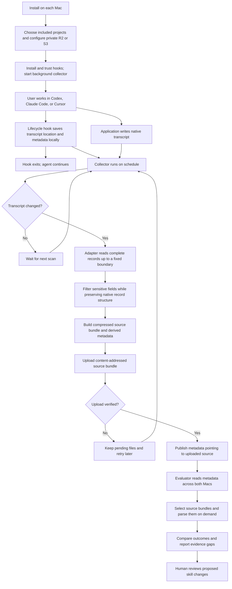

# Private agent-run archive: product and engineering specification

Status: proposed plan for review. This document describes the target design, not the current implementation.

## Product purpose

Collect private evidence of how coding agents perform, with and without skills, across Codex, Claude Code, and Cursor. Make it possible to compare skill versions, models, and harnesses without slowing down normal work or storing private history in this public repository.

The archive answers questions such as:

- Was a relevant skill available but not selected?
- Which skill versions tend to need corrections?
- Does a skill produce more useful results with a particular model or application?
- What evidence supports a proposed skill change?

Real-world observations suggest patterns. They do not establish that the skill, model, or harness caused a difference. Controlled comparisons require comparable tasks and inputs.

## User experience

### CLI and distribution contract

Build a downloadable CLI named `agent-archive`. The initial release supports macOS Apple Silicon and Intel with self-contained executables. Users must not need to install Python, Node, rclone, or a separate database. Publish versioned release artifacts with checksums and macOS signing/notarization. An existing AWS SSO workflow may use the user's AWS CLI, but it is not a dependency for R2 or every authentication mode.

No Agent Archive account or hosted service is required. The user supplies an existing private Cloudflare R2 or Amazon S3 bucket. Both providers are first-class targets of the same S3-compatible storage interface; provider differences remain inside storage configuration and authentication.

| Command | User-facing behavior |
| --- | --- |
| `agent-archive setup` | Guided first-time setup or safe reconfiguration |
| `agent-archive status` | Show storage, collector, hooks, application capture coverage, pending uploads, and actionable errors |
| `agent-archive sync` | Run one collection/upload pass now; preserve queued work on failure |
| `agent-archive pause` | Persistently pause collection, uploads, and remote cleanup without deleting data |
| `agent-archive resume` | Resume scheduled work and process pending eligible sessions |

Support `--help` and `--version`. Keep background-worker and hook entry points internal; normal users should not need to invoke them or edit hook JSON. Return a nonzero exit code for a failed explicit sync or incomplete setup, with a concise explanation. Errors must not print secrets or transcript contents.

### Setup on each Mac

The onboarding sequence is download → select applications/projects → connect storage → review and enable → verify real capture.

The implemented CLI refinement is described in [the setup and CLI plan](agent-archive-cli-plan.md). Setup saves non-secret drafts between completed steps, offers focused edits on rerun, and finishes configuration while app verification is pending. Command help is side-effect-free. Status supports human-readable and versioned JSON output. Uninstall keeps local evidence and credentials unless `--delete-local-data` is explicitly confirmed.

The three user-facing steps are choose apps and projects, connect storage, and
review. Detected apps are offered together; declining opens individual choices.
The current Git project is offered with its full path and explicit confirmation.
Optional settings are available through `edit` at the final summary.

The following requirements describe each part of setup and subsequent verification.

**1. Connect an existing bucket.** Do not create infrastructure or require account-administration permissions in the initial release. Offer provider documentation if the user has not created a bucket yet.

For R2, collect bucket name, the S3 endpoint supplied by Cloudflare, optional prefix (default `agent-archive/`), access key ID, and a hidden secret access key. Use region `auto`. Store credentials in macOS Keychain; configuration contains only their reference. Never accept secrets through command-line arguments, print them, or write them to shell history or project files.

For S3, collect bucket name and an existing AWS profile. Offer locally configured profiles and infer the selected profile's region; ask for a region only when missing. Keep the optional prefix and region override in the final review's Edit menu. Use the selected SDK's supported AWS credential providers, including IAM Identity Center where available. Store the profile reference rather than copying credentials. Honor an explicitly selected profile deterministically; do not silently use an unrelated environment credential. Explain how to configure an AWS profile if none exists.

Use separate credentials per Mac scoped to the intended bucket/prefix where supported. Existing credentials must cover upload, read, listing, and deletion for retention cleanup. An AWS bucket using additional controls such as customer-managed encryption may need extra permissions; surface the actual failure rather than requiring broad permissions by default.

**2. Verify access with synthetic content.** Under a unique setup-test key inside the chosen prefix, write a small object, read it back, verify its bytes, list it, and delete it. Never test against an existing user object. This step sends no transcript data. If cleanup fails, show the exact test-object key and the missing capability.

Successful object access does not establish bucket privacy. Check public-access configuration when authorized, otherwise report `privacy not verified` and link to provider instructions. Do not request administrative access solely to perform that check or present a successful upload test as proof of privacy.

Validate that the background execution environment can resolve the chosen credentials, not just the interactive shell. If Keychain access is unavailable or an AWS login expires and cannot refresh, retain pending uploads and explain the recovery action in `status`. Never launch interactive authentication from the scheduled worker.

**3. Select applications and projects.** Detect installed Codex, Claude Code, and Cursor versions. Let the user choose integrations and explicitly include project roots. Do not automatically include every repository. Record unsupported versions and missing transcript support as unverified capabilities.

Present these initial settings:

```text
Capture sessions without detected skill use? Yes
Import existing conversation history?        No
Retention:                                  90 days
```

No-skill capture remains the default to preserve comparison evidence. The initial release captures only sessions started after the per-project activation time. Resuming an older conversation must not silently upload its previous contents. If the start time cannot be established, leave the session uncollected and explain why. Historical import is disabled initially; a future explicit import flow is separate from setup. Re-running setup must preserve activation times for existing included projects.

Retention is configurable and explicitly accepted during setup before any cleanup begins. Show what content is retained, that filtering is best effort, and that sensitive content can remain.

**4. Review and enable.** Present one concrete summary before installing or activating hooks:

```text
Storage:       R2 / personal-agent-archive / agent-archive/
Applications:  Codex, Claude Code
Project:       /Users/example/work/project
History:       New sessions only
Retention:     90 days

Start archiving? [Y/n/edit]
```

Merge only owned lifecycle hooks, preserve unrelated handlers, and guide the user through each application's required trust flow. Install a macOS LaunchAgent that starts at login and schedules the collector. Store runtime files outside project repositories. Do not mark hooks as trusted automatically.

Setup is repeatable: no duplicate hooks, collector jobs, or machine identities. On cancellation or failure, retain a working previous configuration and report any incomplete setup. Changing the destination does not silently copy old archives or redirect already queued records; require an explicit disposition for pending work. Reducing retention must show its deletion effect before activation.

**5. Verify actual capture.** After storage verification, ask the user to start a new harmless conversation in each selected application and included project. Confirm local capture, publication, and read-back. This is distinct from the synthetic storage-access test.

```text
Storage connection       Ready
Background collector     Running
Codex capture            Verified
Claude Code capture      Waiting for first session
```

Configuration may finish while application verification is pending, but `status` must show that distinction. Never label every integration verified based only on a successful bucket connection.

### Second Mac and routine controls

Run `agent-archive setup` again on the second Mac with the same bucket and prefix, separate credentials, and independently selected project paths. Generate a new machine identity. Do not copy local ownership records or runtime state. Each Mac publishes only its own archived sessions; readers may inspect both.

`pause` persists across restarts. Hooks perform no new registrations while paused; a running collector finishes or safely stops its current operation and starts no further work. The command reports when paused state is reached. Native application logs remain untouched. On resume, registered eligible sessions can catch up, including activity written to their native transcripts during the pause; this behavior must be stated in command help. Pause is not a privacy exclusion or an instruction to erase evidence. New sessions that began while paused are not discovered retroactively.

`sync` respects paused state and does not implicitly resume. `status` shows last scan and successful publication, pending count, authentication health, per-application trust/verification state, and capture gaps without printing conversation contents. No dashboard is needed for onboarding or routine use.

### Normal work

The user works normally. The application writes its own transcript. Small hooks register the transcript and request collection. A background process reads changed transcripts and publishes snapshots.

Capture applies to all included sessions, including those without detected skill use. The working agent does not summarize, evaluate, upload, or troubleshoot the archive. Normal recording produces no conversation messages or extra model calls.

### Inspect and evaluate

The user can inspect capture status, filter the metadata catalog, open a session, add explicit feedback, and request a skill evaluation. The evaluator reads relevant histories only after selecting candidates from metadata. Proposed skill changes remain subject to human review.

The archive supplies evidence for Evaluate Skill. Building that evaluation skill and an automated benchmark runner are separate work.

## End-to-end process map



The durable application transcript and local pending files let collection resume after a restart. A stop hook is a request to catch up, not proof that the transcript is complete.

## Scope and non-goals

Initial scope is local macOS sessions in the three applications. Remote and cloud-hosted sessions require a collector in their execution environment and are not automatically covered by a Mac installation. Each supported application version needs a capture test.

The first version does not provide a web dashboard, distributed event stream, server-side search database, automatic skill edits, exact execution replay, or storage of every streaming token. It does not archive untouched native logs by default.

## Components

| Component | Responsibility |
| --- | --- |
| Lifecycle hook | Save a small local registration or collection request and return |
| Application adapter | Filter native records for archival; separately derive metadata and normalized analysis views |
| Background collector | Detect changes, build snapshots, publish them, retry failures, and clean up old snapshots |
| Local files | Registrations, upload requests, pending snapshots, acknowledgments, and status |
| Private R2 or S3 bucket | Shared metadata and compressed filtered source bundles |
| Reader/evaluator | Select metadata, parse retained source on demand, and inspect evidence |

The CLI provides one common storage interface for R2 and S3 and uses an SDK directly, without rclone. No database or hosted compute service is required initially. Per-machine locking prevents overlapping collector processes. Each session has one owning writer.

## Lifecycle integration

| Application | Intended hooks | Transcript evidence | Validation still required |
| --- | --- | --- | --- |
| Claude Code | `SessionStart`, `Stop`, `StopFailure`, `SessionEnd`; subagent registration where supported | JSONL via hook-provided `transcript_path`; stop payload can supply final response | Installed-version schema, final-message reconciliation, model and skill attribution |
| Cursor | `sessionStart`, `stop`, `sessionEnd`; subagent registration where supported | Hook-provided path; current documentation describes JSONL and includes text-path examples | Actual installed format, retained tool outputs, model routing, skill attribution |
| Codex | `SessionStart`, `Stop`, `Interrupt`, `SessionEnd`; subagent registration where supported | JSONL rollout via hook-provided path | Version-aware parser, subagent linkage, skill attribution |

Use hook-provided paths rather than reconstructing application directories. Treat missing paths as a capture gap. Do not silently claim a complete record.

Native asynchronous hooks are not the upload mechanism. They can be canceled at application shutdown, and support differs between applications. A short local write followed by a separate collector is the common approach. No per-tool recording hook is required.

## Capture and publication sequence

1. A start/resume hook records the native session ID, transcript path, project, available harness metadata, and event time. It creates or finds a persistent random archive session ID.
2. A stop, failure, or end hook writes a small request. Preserve useful hook-only metadata, such as the model selection or final response. Never inject recording instructions into model context.
3. The collector runs approximately once a minute. It also scans registered transcripts for changes while an agent is working.
4. For each changed session, read only complete records up to a fixed file boundary. Preserve native record order, identities, and allowed fields. Do not mix evidence from different capture boundaries.
5. Apply the privacy filter and validate its output. Build a source bundle containing filtered native records and separately labeled supplemental evidence. Derive the metadata summary from that bundle with a versioned parser. Do not persist a second full normalized transcript.
6. Serialize and gzip the source bundle deterministically. Compute SHA-256 over the exact compressed bytes. Save it and its matching metadata as pending local files using atomic replacement.
7. Upload the source bundle to its content-addressed key. Verify uploaded content integrity. Do not assume an object ETag is its SHA-256.
8. Replace `metadata.json` only after verification succeeds. Metadata publication is the point at which readers discover the new snapshot.
9. Mark the local request complete only after metadata publication succeeds. Requests received during processing remain pending.
10. Remove eligible old snapshots later. Never delete the currently referenced source bundle.

Starting cadence: scan every minute, upload no more than once every three minutes per active session, and publish a stopped turn on the next collector pass when possible. Coalesce multiple requests. Upload only when retained content or meaningful metadata changes; a new scan timestamp alone must not trigger an upload.

For small personal archives, rereading a changed transcript is simpler than maintaining byte-offset ingestion. Measure cost before adding incremental parsing.

### Timestamp and unchanged-input rules

Separate source event times, snapshot capture time, metadata derivation time, and local operational times:

- Preserve native event timestamps as evidence. Do not replace them with the time the collector reads a record.
- `captured_at` identifies when a retained source snapshot was first captured. Set it only when retained evidence or its capture/filter provenance changes. Reuse it when rebuilding or retrying the same snapshot.
- `metadata_derived_at` identifies when the published summary was derived. Change it only when the source reference, parser version, or meaningful summary fields change. A parser upgrade may update metadata while preserving `captured_at` and the source object.
- Keep `last_scanned_at`, upload-attempt times, and last successful upload time in local operational status. They are not inputs to the archived source hash or metadata change detection.

Compare the filtered evidence and meaningful provenance before assigning a new capture timestamp. A changed file modification time, a later polling time, or a raw byte offset advancing through excluded records does not establish new retained evidence. Keep scan offsets locally; the archived capture boundary describes the retained evidence represented by that snapshot and stays fixed until that evidence or its provenance changes.

Serialize deterministically, including stable record order and gzip headers with a fixed modification time. Persist the timestamped snapshot and reuse its exact bytes for upload retries. Hash the final compressed bytes. Exclude operational times and automatically generated derivation times from the comparison that decides whether to publish; otherwise the act of scanning would itself create a change.

## Archive format

One session has one readable, derived metadata document and compressed source snapshots:

```text
sessions/<harness>/<archive-session-id>/
  metadata.json
  source.<sha256>.json.gz
```

All object keys shown are relative to the configured bucket prefix. There are no date or machine parent directories. Machine identity and dates are metadata. A copied conversation on another machine gets a different archive ID and may link to the original; this prevents competing writers.

Use UTF-8 JSON, gzip, and a published JSON Schema with `schema_version`. Use OpenTelemetry GenAI attribute names where their meanings match observed data. Pin the adopted conventions revision. This archive is not an OTLP export and does not require CloudEvents envelopes.

### Metadata sidecar

The following is illustrative. IDs, versions, and hashes are shortened examples.

```json
{
  "schema_version": 1,
  "session_id": "archive-123",
  "native_session_id": "native-456",
  "machine_id": "mac-a",
  "started_at": "2026-09-17T18:00:00Z",
  "captured_at": "2026-09-17T18:25:00Z",
  "metadata_derived_at": "2026-09-17T18:25:01Z",
  "state": "idle",
  "project_id": "project-789",
  "harness": {
    "name": "codex",
    "version": "observed-build",
    "mode": "desktop"
  },
  "adapter": {
    "name": "codex",
    "version": "0.1.0"
  },
  "parser": {
    "name": "codex",
    "version": "0.1.0",
    "status": "partial"
  },
  "filter_version": "1",
  "models": [
    {
      "attributes": {
        "gen_ai.provider.name": "openai",
        "gen_ai.request.model": "gpt-6-astra",
        "agent_archive.request.reasoning_level": "high"
      },
      "source": "native_transcript",
      "response_model_status": "not_exposed",
      "turn_count": 4
    }
  ],
  "skills_available": [
    {"name": "review-pr", "sha256": "skill-hash"}
  ],
  "skills_used": [
    {
      "name": "review-pr",
      "sha256": "skill-hash",
      "turn_count": 2,
      "evidence": "native_invocation"
    }
  ],
  "skill_detection": "partial",
  "counts": {
    "turns": 4,
    "tool_calls": 18,
    "explicit_feedback": 1
  },
  "capture_gaps": ["actual_response_model_not_exposed"],
  "source_bundle": {
    "key": "sessions/codex/archive-123/source.abc123.json.gz",
    "sha256": "abc123",
    "compressed_bytes": 48216
  }
}
```

Metadata contains summaries computed by code. Prompts, tool contents, and answers belong in the compressed source bundle. The sidecar remains private: even skill names, project identifiers, and usage patterns can be sensitive. Record the parser version and status used to derive the summary. Missing or failed parsing yields unknown counts and unavailable attribution, not zeros or a claim that no skill was used.

### Durable source, derived views

The filtered native source is the durable evidence. Metadata is a replaceable summary. A normalized conversation is an analysis view produced on demand, not a second full history stored in object storage.

This preserves the ability to fix a parser or ask new questions about retained fields later. It supports reproducible parsing and reanalysis, not exact replay of an agent run. Exact execution replay would also require code revisions, tool environments, external inputs, and other state that this archive does not promise to capture.

### Compressed source bundle

Use a small versioned JSON envelope containing:

- `schema_version` and archive session identity.
- `capture`: application and adapter versions, source format, capture boundary, filter version, and known gaps.
- `native_records`: filtered native transcript records in source order, preserving their native field names and structure rather than converting them into a universal message schema.
- `supplemental_evidence`: filtered hook-only observations, explicit feedback, observed harness configuration, skill inventories, and available skill snapshots, each with provenance and observation time.
- Optional linked subagent sources in the same envelope, identified separately from the parent transcript.

Source content is not an untouched dump or byte-for-byte backup. Filtering removes excluded content and can impose explicit size limits. Record removed categories and truncation without reproducing sensitive values. Redacted or omitted information cannot be recovered through a later parser. Unknown record types or fields must pass the privacy policy before preservation; never upload unrecognized content merely to retain everything.

Keep native model settings and response model identifiers wherever exposed. Derive per-turn and per-call model attribution at read time. A metadata summary must not assign one model to an entire mixed-model session. Unknown values remain unknown.

Preserve source message IDs, parent links, and timestamps when available. Hook final messages remain separate evidence rather than being inserted into the native transcript. The reader reconciles them with native messages to avoid duplicate answers; uncertainty is reported instead of silently discarding evidence. Identical text alone is not a duplicate.

Retain filtered skill instruction snapshots when available. Skill hashes identify original source bytes; note when the archived copy is redacted. Capture installed skill versions when observed and when inventory changes. A skill file read later is not proof of its exact contents at invocation time: record observation time and uncertainty.

A parent transcript alone must not be labeled as complete subagent coverage. If the application exposes text rather than structured records, retain filtered text with its format label; do not manufacture native events.

### Reanalysis and scale

Initially, select sessions using metadata and parse their source bundles in memory. If repeated analysis becomes costly, add a disposable local cache keyed by source hash, parser version, and normalized-view schema version. The cache is not authoritative and must follow the archive's privacy and retention policy.

A parser upgrade can rebuild metadata from an unchanged source bundle without creating another history object. The owning collector remains the only publisher of that session's metadata; other readers can use local derived views. Preserve the source capture timestamp separately from any metadata derivation timestamp.

Only add a shared normalized dataset or search index after measured usage justifies it. Neither is needed for the initial product.

## Skill attribution and interpretation

Prefer native skill-invocation evidence. A skill-file read is an inference, not proof that the instructions were applied. Passive adapters should identify available evidence first; explicit agent markers are not a default requirement of this design.

Track inventory coverage independently from use detection. The collector's filesystem scan shows installed skills; it may not prove that the application discovered them or that they were eligible in the current mode.

Distinguish:

- `observed_none`: supported detection found no use in the captured scope.
- `partial`: some uses can be identified, but coverage has gaps.
- `unavailable`: the adapter cannot determine use.
- `observed`: use was found; attach the detection method to each use.

Never label a task successful merely because a turn ended. Feedback, corrections, tests, and other validation are evidence with different strengths. Session state (`active`, `idle`, `closed`, `unknown`) is separate from turn outcome (`completed`, `interrupted`, `error`, `unknown`). A stop event normally means idle, not that the session can never resume.

## Privacy, retention, and access

- Archive only included project roots. Missing project attribution requires explicit inclusion before content upload.
- Filter before writing upload-ready files. Retain visible conversation and useful tool evidence; exclude hidden reasoning, credentials, and raw system/developer instructions by default.
- Redaction is best effort. Set explicit content-size limits and report omissions. Images, binary outputs, and external artifacts are omitted initially with references and gaps where appropriate.
- Keep runtime state and credentials outside all Git checkouts. Public repository content consists only of code, schemas, tests, and documentation.
- Keep the bucket private, with separate credentials per Mac. Do not infer append-only permissions from content-addressed filenames.
- Keep the current source snapshot and its predecessor. Delete older unreferenced snapshots after a proposed 24-hour grace period. Readers that encounter a deleted older snapshot should refresh metadata and retry.
- Propose 90 days of whole-session retention, configurable before activation. Delete metadata and all associated source snapshots together. Do not apply a source-only age rule that can leave a live pointer dangling.
- Excluding a project stops future capture; deleting already archived data is a separate explicit operation.

R2 and S3 serve objects, not queries over JSON fields. Initially readers list/download metadata sidecars and filter locally. No server-side catalog is required. A local cache is disposable and must respect the chosen retention policy.

## Failure behavior

| Failure | Expected behavior |
| --- | --- |
| Hook cannot write a request | Task continues; diagnostic is available outside model context; registered transcript scans may recover |
| Offline or storage unavailable | Keep pending files and retry with bounded backoff |
| Process exits during upload | Retry the same content-addressed source bundle; do not advance metadata early |
| Metadata upload fails | Prior published snapshot remains readable; retry publication |
| Transcript missing or disabled | Report incomplete coverage; preserve last good snapshot |
| Summary parser fails but privacy filtering succeeds | Archive the filtered source with minimal metadata and `parser.status: failed`; retry parsing later |
| Source format cannot be safely filtered | Do not upload new content; preserve last good snapshot and report the gap |
| Last transcript record is incomplete | Ignore that record until a later scan |
| Transcript is rewritten or compacted | Do not silently replace richer evidence with a truncated source; retain the last good bundle and report the discontinuity until the adapter can safely handle it |
| Two collector processes start | Machine-level lock permits one uploader |
| Disk pressure | Report collection failure and stop making new copies; preserve native logs and existing archive |

Status must distinguish captured locally, pending upload, published, and failed. It should show last successful publication, pending count, supported adapter versions, and coverage problems without printing private transcript contents.

## Evaluation process

```mermaid
flowchart LR
    A[User requests Evaluate Skill] --> B[Fetch readable metadata]
    B --> C[Filter by skill, harness, model, date, and coverage]
    C --> D[Select used-skill and eligible no-use examples]
    D --> E[Download selected compressed source bundles]
    E --> P[Parse into normalized views in memory]
    P --> F[Inspect outputs, corrections, and validation]
    F --> G[Report findings and confounding factors]
    G --> H[Propose a skill change for human review]
```



Retain enough provenance to link every finding to its source session and turn. Load additional history only when needed. Observational comparisons should control for skill version, harness version, model, settings, and task differences where possible, and disclose selection bias and missing evidence.

## Validation and rollout

1. **Capability proof:** one synthetic session per installed application, with known messages, a tool call, a skill invocation, a no-skill turn, and a model change where supported. Document what each adapter can actually observe.
2. **Local vertical slice:** implement one adapter through filtered source capture, derived metadata, and on-demand normalized views. Test filtering, IDs, deterministic snapshots, and recovery. Keep the existing recorder clearly separate until migration.
3. **CLI onboarding and storage round trips:** build the five-command interface and guided setup described above, produce both macOS executable builds, and test against private R2 and AWS S3; validate source-first publication, integrity, retries, readable metadata, and cleanup using synthetic content.
4. **Remaining adapters:** reuse the same collector and schema; add only application-specific extraction and hook configuration.
5. **Two-Mac trial:** confirm independent ownership, combined metadata browsing, offline recovery, and no cross-machine overwrites.
6. **Evaluate Skill integration:** add evidence selection and human-reviewed recommendations as separate work.

Acceptance criteria:

- A fresh Mac can configure either provider through `agent-archive setup` without installing an application runtime or manually editing hook files.
- Both macOS architectures and both storage providers pass synthetic upload/read/list/delete tests and application capture checks.
- Setup reruns preserve unrelated hooks, identities, existing project activation times, and working configuration. No conversation uploads occur before explicit enablement.
- Credentials stay in Keychain or the selected AWS provider; background authentication failures leave data queued and produce actionable status.
- Older resumed sessions are excluded by default; no-skill sessions started after activation remain eligible.
- Pause persists across login, prevents new scheduled collection/uploads/cleanup, and is respected by manual sync.

- No per-tool recording hook, model-generated logging summary, or remote request on the agent's critical path.
- Proposed hook timing target: p95 below 100 ms on the supported machine, measured rather than assumed. If missed, optimize the small request writer.
- A stopped turn normally publishes within two collector intervals when online and the transcript is available. Coverage gaps remain visible when this is impossible.
- Repeated processing of unchanged input does not create new source objects or duplicate messages in the analysis view.
- Repeated scans at different times preserve the source hash, `captured_at`, and `metadata_derived_at`, and perform no remote object writes when retained evidence, provenance, and meaningful metadata are unchanged. A modification-time-only change has the same result.
- A parser-version change may republish metadata with a new `metadata_derived_at` while leaving the source hash and `captured_at` unchanged. Retrying publication reuses the pending metadata rather than generating another timestamp.
- Every published metadata pointer identifies a verified source bundle with matching metadata and capture boundary.
- Readers can select by model, harness, skill version, and coverage without decompressing histories.
- Mid-turn model switches and no-skill sessions are represented without invented values.
- Synthetic secret fixtures are removed before upload; omissions and filter versions are explicit.
- Fixing a summary parser can recover previously missed allowed fields from archived source without recapturing the original session.
- Parser failure after successful filtering retains source with minimal metadata; filter failure uploads no new content.
- No second full normalized transcript is persisted in object storage. Metadata regeneration leaves unchanged source objects intact.
- Crash, retry, delayed-final-message, compaction, and metadata-publication failures have meaningful tests.
- Compare capture enabled/disabled on representative tasks for latency and resource use before broad activation. No claim of zero performance impact without measurement.

## Existing implementation and migration

The repository currently contains a Codex-only prototype using per-tool hooks, agent-reported skill markers, a local SQLite store, and per-run compressed bundles. That is not this target design.

Migration must remove only the prototype's owned hooks, preserve unrelated hooks, retain existing private records, and replace the upload job deliberately. Existing records should retain their original schema and coverage labels; do not silently reinterpret them as complete session snapshots. No rollout or credential configuration is performed by committing this plan.

## Reference documentation

These sources establish integration capabilities, not a promise of identical coverage in every installed version:

- [Claude Code session storage](https://code.claude.com/docs/en/sessions)
- [Claude Code hooks](https://code.claude.com/docs/en/hooks)
- [Cursor hooks](https://cursor.com/docs/hooks)
- [Cursor transcript changelog](https://cursor.com/changelog/page/11)
- [Codex hooks](https://learn.chatgpt.com/docs/hooks)
- [OpenTelemetry GenAI conventions](https://github.com/open-telemetry/semantic-conventions-genai/blob/main/docs/gen-ai/gen-ai-spans.md)
- [R2 S3 API compatibility](https://developers.cloudflare.com/r2/api/s3/api/)

- [R2 S3 setup](https://developers.cloudflare.com/r2/get-started/s3/)
- [AWS credential providers](https://docs.aws.amazon.com/sdkref/latest/guide/standardized-credentials.html)
